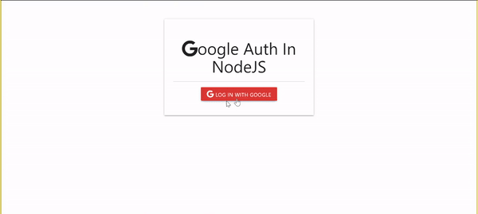

# Google Auth In nodeJS
This is the implementation of google Auth in node using passport. Log in using your google acount and get redirect to dashboard.ejs. The content in dashboard.ejs can be replace for your own content.

<article>
      

  

<table>
  <tbody><tr>
    <td width="100%" valign="top">
      <h3><a id="user-content-portfolio" class="anchor" aria-hidden="true" href="#portfolio"><svg class="octicon octicon-link" viewBox="0 0 16 16" version="1.1" width="16" height="16" aria-hidden="true"><path fill-rule="evenodd" d="M7.775 3.275a.75.75 0 001.06 1.06l1.25-1.25a2 2 0 112.83 2.83l-2.5 2.5a2 2 0 01-2.83 0 .75.75 0 00-1.06 1.06 3.5 3.5 0 004.95 0l2.5-2.5a3.5 3.5 0 00-4.95-4.95l-1.25 1.25zm-4.69 9.64a2 2 0 010-2.83l2.5-2.5a2 2 0 012.83 0 .75.75 0 001.06-1.06 3.5 3.5 0 00-4.95 0l-2.5 2.5a3.5 3.5 0 004.95 4.95l1.25-1.25a.75.75 0 00-1.06-1.06l-1.25 1.25a2 2 0 01-2.83 0z"></path></svg></a>Demo</h3>
            
        
<strong>Google AUTH</strong>

    </td>
  </tr>
</tbody></table>
</article>

## How To Use:
  - Fork the repo
  - Clone your forked repo.
  - In the config folder Create a `config.env` file and add the following:
  - PORT = 8000 or any port you would like
  - MONGO_URI = Your database URI Note : I used MongoDB when testing
  - GOOGLE_CLIENT_ID = Your google client ID from Google cloud console https://console.cloud.google.com/
  - GOOGLE_CLIENT_SECRET = Your Google client secret from Google cloud console.

## Lesson Learned:

Google AUTH in nodeJS using Passport.